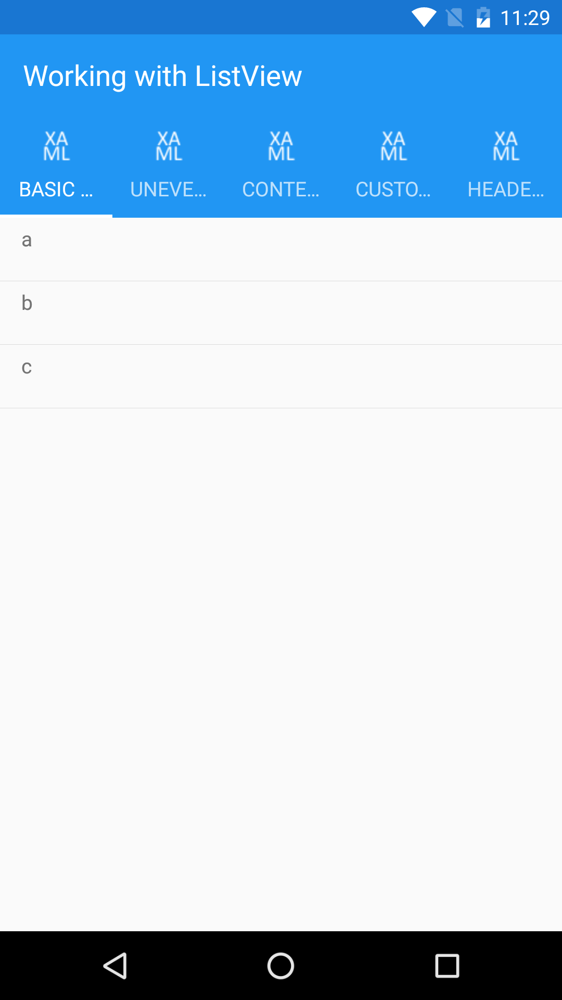
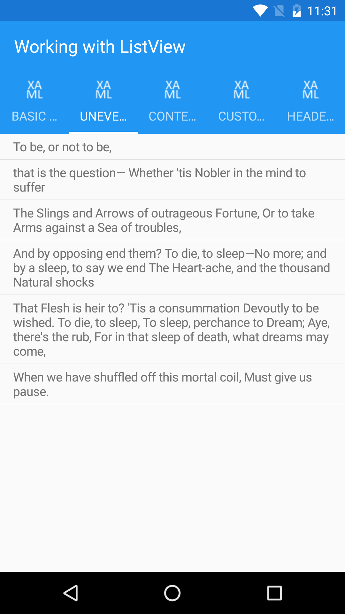
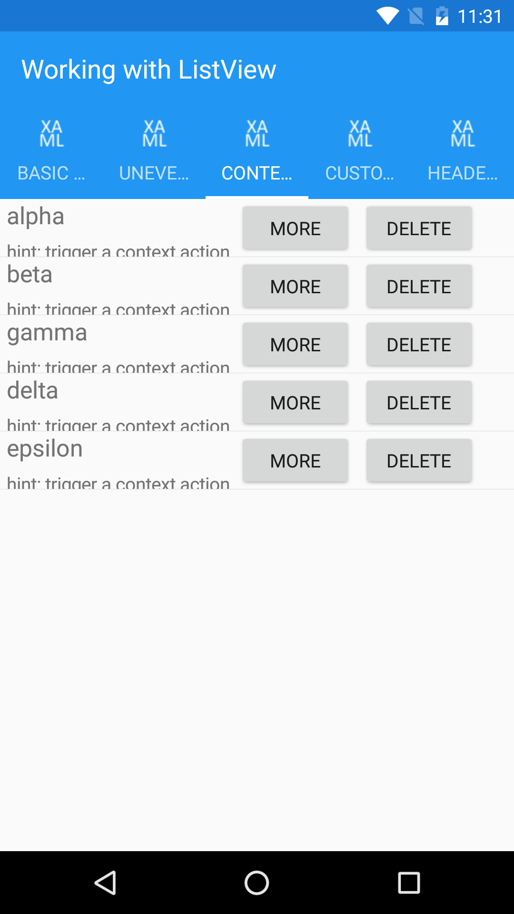
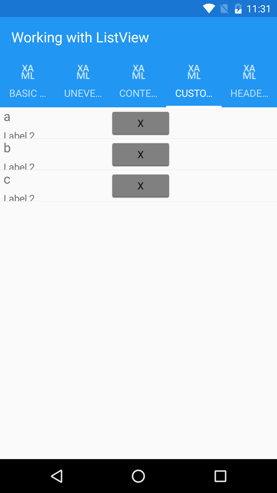
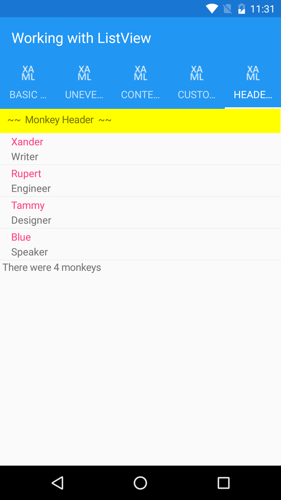

Working with ListView
=====================

This sample relates to the [Working with ListView in Xamarin.Forms](http://developer.xamarin.com/guides/cross-platform/xamarin-forms/working-with/listview) but I rewrite with prism libary with appropriate updates to remove all code behind into view model. I removed all UI element written in code behind and replicate them in XAML.   

License
-------

This adapted sample inherits the Apache License 2.0 from the original sample:

   Copyright 2011 Xamarin Inc

   Licensed under the Apache License, Version 2.0 (the "License");
   you may not use this file except in compliance with the License.
   You may obtain a copy of the License at

       http://www.apache.org/licenses/LICENSE-2.0

   Unless required by applicable law or agreed to in writing, software
   distributed under the License is distributed on an "AS IS" BASIS,
   WITHOUT WARRANTIES OR CONDITIONS OF ANY KIND, either express or implied.
   See the License for the specific language governing permissions and
   limitations under the License.

---

*Original README.md follows:*
Working with ListView
==============

These samples relate to the [Working with ListView in Xamarin.Forms](http://developer.xamarin.com/guides/cross-platform/xamarin-forms/working-with/listview) doc.

Many people have questions about specific `ListView` features, this sample attempts to cover some of them:

* De-selecting the row after tapping
* Uneven row heights
* Adding clickable buttons to cells that work on Android

See the [working with ListView "native layouts"](https://github.com/xamarin/xamarin-forms-samples/tree/master/WorkingWithListviewNative) for tips on using custom renderers for cells or the entire `ListView`. 

Author
------

Craig Dunn
