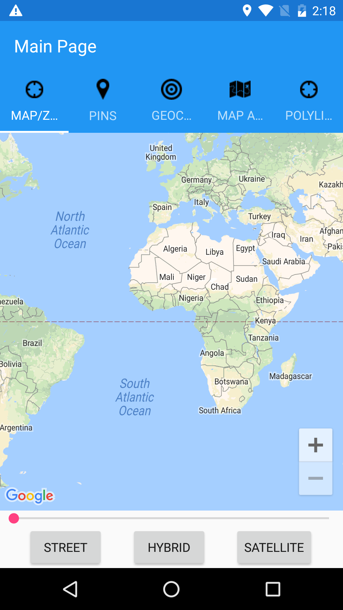
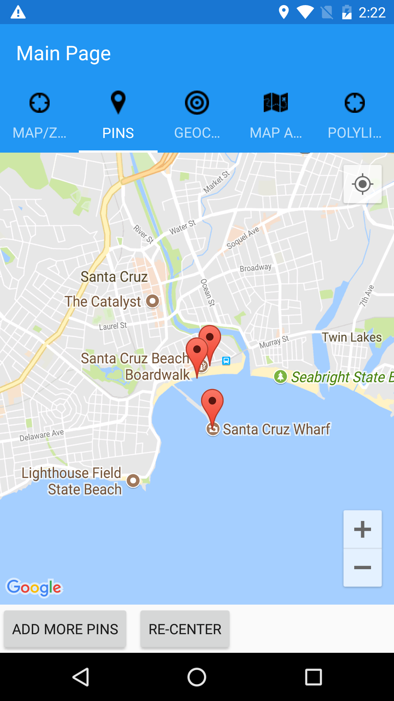
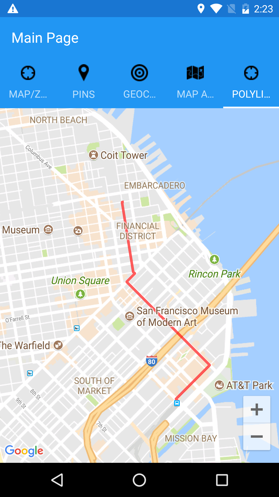

Working with Maps
==============

This sample relates to the [Working with Maps in Xamarin.Forms](http://developer.xamarin.com/guides/cross-platform/xamarin-forms/working-with/maps) doc but rewrite with prism library and all latest nuget packages at the time of writing in Feb 2018. 

Requirements 
------------
An iOS provisioning profile is required to deploy this sample to a simulator.

---

License
-------

This adapted sample inherits the Apache License 2.0 from the original sample:

   Copyright 2011 Xamarin Inc

   Licensed under the Apache License, Version 2.0 (the "License");
   you may not use this file except in compliance with the License.
   You may obtain a copy of the License at

       http://www.apache.org/licenses/LICENSE-2.0

   Unless required by applicable law or agreed to in writing, software
   distributed under the License is distributed on an "AS IS" BASIS,
   WITHOUT WARRANTIES OR CONDITIONS OF ANY KIND, either express or implied.
   See the License for the specific language governing permissions and
   limitations under the License.

---

*Original README.md follows:*

Working with Maps
==============

This sample relates to the [Working with Maps in Xamarin.Forms](http://developer.xamarin.com/guides/cross-platform/xamarin-forms/working-with/maps) doc.

Requirements 
------------
An iOS provisioning profile is required to deploy this sample to a simulator.

Author
------

Craig Dunn